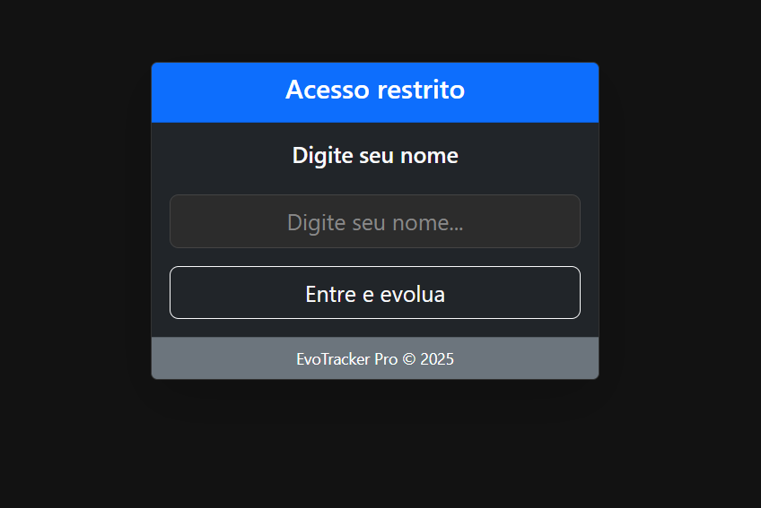
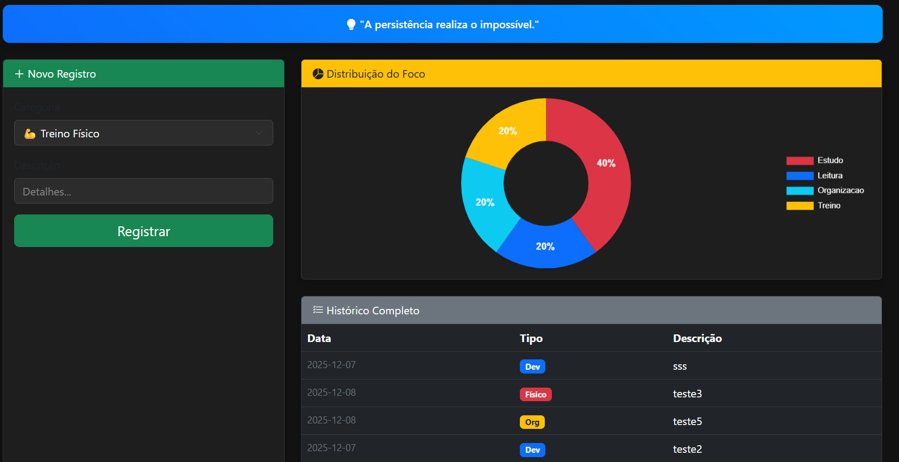

# 🚀 EvoTracker Pro


> **Sua evolução pessoal, documentada e visualizada.**

O **EvoTracker Pro** é uma aplicação Full Stack de monitoramento de hábitos e desempenho. Desenvolvido para registrar treinos físicos, sessões de estudo e outras atividades diárias, transformando dados brutos em gráficos visuais e insights de progresso.

---

## 🔗 Demonstração Online
Acesse o projeto rodando em tempo real na nuvem:
### [👉 Clique aqui para acessar o EvoTracker](https://evotracker.onrender.com/login)

*(Nota: Como é hospedado em serviço gratuito, o primeiro carregamento pode levar alguns segundos)*

---

## 🛠 Tecnologias Utilizadas

Este projeto foi construído utilizando uma arquitetura moderna e escalável:

### Back-end
- **Python 3**: Linguagem principal.
- **Flask**: Framework web para criação de rotas e lógica de servidor.
- **Gunicorn**: Servidor WSGI para produção.

### Front-end
- **HTML5 & CSS3**: Estrutura e estilização.
- **Bootstrap 5**: Framework para design responsivo e componentes modernos (Dark Mode).
- **Jinja2**: Template engine para renderização dinâmica de dados.
- **Chart.js**: Biblioteca JavaScript para visualização de dados (Data Visualization).

### Banco de Dados & Cloud
- **Google Firebase Firestore**: Banco de dados NoSQL em tempo real na nuvem.
- **Render**: Plataforma de deploy e hospedagem da aplicação.

---

## ✨ Funcionalidades

- 🔐 **Sistema de Login:** Autenticação simples baseada em sessão (Case-insensitive).
- 📊 **Dashboard Visual:** Gráfico de Rosca (Doughnut Chart) com porcentagens automáticas usando Chart.js.
- 🌑 **Dark Mode UI:** Interface moderna e agradável aos olhos, totalmente responsiva para mobile.
- 💾 **Persistência de Dados:** Histórico salvo na nuvem (Firebase), acessível de qualquer dispositivo.
- 🛡 **Filtro de Usuário:** Cada usuário vê apenas os seus próprios registros.
- 💡 **Gamificação:** Frases motivacionais aleatórias a cada acesso.

---
## 📸 Screenshots

Aqui estão algumas telas do sistema em funcionamento:

### Tela de Login


### Dashboard Principal (Dark Mode)

---

## 🚀 Como rodar localmente

Se você deseja rodar este projeto na sua máquina:

1. **Clone o repositório**
   ```bash
   git clone [https://github.com/Aether-cd/EvoTracker.git](https://github.com/Aether-cd/EvoTracker.git)
   cd EvoTracker
